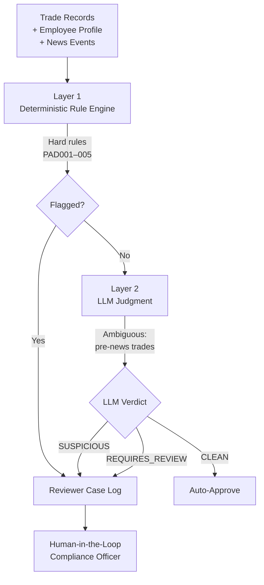

# PAD Trade Monitor

An AI-assisted compliance review system for **Personal Account Dealing (PAD)** — detecting suspicious pre-news trades by employees of licensed financial firms, combining a deterministic rule engine with an LLM judgment layer.

**Live sibling project:** [audit-compliance-copilot](https://github.com/lochiel-huang/audit-compliance-copilot) — the back-office counterpart (voucher anomaly detection).

Together they form a two-sided view of financial compliance automation:
- **audit-compliance-copilot** → back-office (accounting voucher review)
- **pad-trade-monitor** → front-office (personal trade surveillance)

---

## Why this project

Personal Account Dealing rules require licensed firms to monitor employees' own trades for potential misuse of Material Non-Public Information (MNPI). Traditional workflows rely on manual review: a compliance officer scans hundreds of trades weekly, cross-referencing news events, restricted lists, blackout periods and employee roles.

The manual approach has two failure modes:
- **Alert fatigue** — reviewers deprioritize alerts after too many false positives.
- **Silent misses** — subtle cases (e.g. "sold 3 days before an unfavorable profit warning") get lost in volume.

This prototype demonstrates a **two-layer architecture** that separates deterministic checks from contextual judgment, targeted at reducing both failure modes.

---

## Architecture



### Layer 1 — Deterministic Rule Engine

Five hard rules with immediate structured output. No LLM cost, fully explainable, replayable.

| Code | Rule | Severity |
|---|---|---|
| PAD001 | Trading in Restricted List security | HIGH |
| PAD002 | No pre-clearance obtained | HIGH |
| PAD003 | Trading during Blackout Period | HIGH |
| PAD004 | Analyst trading in covered stock (conflict of interest) | MEDIUM |
| PAD005 | Holding period violation (sold within 30 days of buy) | MEDIUM |

### Layer 2 — LLM Judgment (DeepSeek + function calling)

Handles **contextually ambiguous** cases the rule engine cannot: pre-news trading suspicion, where the same trade may be innocent or suspicious depending on employee MNPI access level, direction consistency with news, and trade size.

The prompt encodes a five-dimensional judgment framework plus four **decisive rules** that constrain the LLM's output space:

- **Rule A** — Direction inconsistent (BUY before bad news / SELL before good news) → force downgrade below SUSPICIOUS
- **Rule B** — LOW MNPI access employees → force downgrade below SUSPICIOUS
- **Rule C** — HIGH access + direction consistent + ≤ 3 days → mandate SUSPICIOUS
- **Rule D** — HIGH access + direction consistent + 4–5 days → at least REQUIRES_REVIEW

Structured output is enforced via OpenAI-compatible function calling (`tool_choice`).

---

## Evaluation Results

Tested on synthetic dataset: **800 trades / 100 employees / 6-month window**, injected with 6 hard-rule violation types + 3 "decoy trap" types (high-suspicion appearance but should be judged CLEAN).

### Layer 1 — Rule Engine

| Metric | Score |
|---|---|
| Precision | 100.00% |
| Recall | 100.00% |
| F1 | 100.00% |

### Layer 2 — LLM Judgment (v3, after three prompt iterations)

| Metric | Score |
|---|---|
| True Violation Precision | 83.78% |
| True Violation Recall | 86.11% |
| True Violation F1 | 84.93% |
| Decoy Over-flag Rate | 14.1% |
| Decoy Correct-Clean Rate | 70.3% |

### Prompt Iteration History

The LLM layer went through three prompt versions to converge:

| Version | Change | True Violation F1 | Decoy Over-flag |
|---|---|---|---|
| v1 | Baseline framework with soft "counter-example rules" | 67.6% | 47.6% |
| v2 | Upgraded counter-examples to hard decisive rules | 86.8% | 35.9% |
| **v3** | Added mandatory direction-check pre-step + tool schema warning | **84.9%** | **14.1%** |

The v2→v3 fix addressed a specific DeepSeek failure mode: **reasoning-output desynchronization** — the model's chain-of-thought correctly identified the applicable rule, but the final `label` field in the function call output did not reflect it. Enforcing the direction check as the first mandatory step (before other rules are evaluated), plus embedding a constraint warning directly in the tool schema's `label.description`, resolved 85% of these cases.

---

## Design Decisions Worth Explaining

**Ground truth is stored separately from generated data.** The rule engine cannot "cheat" by reading the answers. This enables honest evaluation of both precision and recall.

**Evaluation counts objective violations, not injection intent.** Initial evaluation showed 67% precision, which I traced to ground truth completeness rather than rule error: a trade injected as "COVERED_STOCK" might also legitimately fall in a Blackout Period, and the rule engine correctly flags both. Independent verification of each rule's applicability restored precision to 100%. **The evaluation trap in compliance AI is often mistaking "generation intent" for "objective fact."**

**Decoy traps as first-class evaluation citizens.** The dataset contains 64 trades that "look suspicious" but should be judged CLEAN (LOW access with perfect timing; HIGH access but wrong direction; sector-wide rally providing alternative explanation). Decoy resistance is measured separately from true-violation detection — a system with 100% recall on real violations but 100% over-flag on decoys is not usable.

**Same architecture as sibling project.** The two-layer pattern (deterministic rules + LLM judgment + structured output) was first validated in `audit-compliance-copilot` for back-office voucher review. Reusing it for front-office trade surveillance demonstrates that this architecture is **domain-transferable within financial compliance**.

---

## Known Limitations

- **5 hard-case misses (v3, 800-trade dataset):** HIGH access, direction-consistent, 1–3 days before news, judged CLEAN. All five stocks also happened to trigger other hard rules (e.g. Restricted List). The LLM appears to "defer" to the rule engine on those tickers, ignoring its own independent responsibility for pre-news anomaly detection. A v4 iteration would explicitly define the LLM's scope of judgment.
- **Distributed-small-order evasion is not modeled.** Splitting one large suspicious trade into 3–4 small ones within days could evade both layers. This is a known real-world evasion pattern; addressing it would require sequence-level modeling.
- **Only Hong Kong equity news modeled.** Extending to derivatives, cross-market or global names would require expanding both the news feed and the direction-inference logic.
- **DeepSeek was chosen over Anthropic API** due to payment-method availability constraints in Hong Kong. The OpenAI-compatible interface makes the model layer swappable.

---

## Tech Stack

- **Python 3.11**, Pydantic v2 for data models, `openai` SDK
- **DeepSeek Chat API** (OpenAI-compatible) with function calling for structured output
- **yfinance** for reference price data (early prototyping)
- **matplotlib** for the outlier diagnostic plot

---

## Repository Layout

```
pad-trade-monitor/
├── schema.py               # Pydantic models: Employee, Trade, RuleFlag, LLMVerdict
├── data_generator.py       # Synthetic PAD trades + ground truth
├── rule_engine.py          # Layer 1: 5 deterministic rules + evaluation
├── llm_judge.py            # Layer 2: DeepSeek prompt (v3) + evaluation
├── analysis_outliers.py    # LLM verdict vs objective suspicion diagnostic
├── diagnose_fp.py          # False-positive diagnosis for rule engine
├── diagnose_llm_fn.py      # False-negative diagnosis for LLM layer
└── .env                    # DEEPSEEK_API_KEY (not committed)
```

---

## Running Locally

```bash
python -m venv .venv
.venv\Scripts\activate     # on Windows
pip install pydantic openai python-dotenv matplotlib

# Set DEEPSEEK_API_KEY in .env
echo DEEPSEEK_API_KEY=sk-your-key > .env

# Generate synthetic dataset
python data_generator.py

# Run Layer 1
python rule_engine.py

# Run Layer 2 (uses DeepSeek API, ~2 minutes)
python llm_judge.py

# Diagnostic plot
python analysis_outliers.py
```

---

## Author

Lochiel Huang (Leen) — BSc Finance & Financial Technology, HKMU
Applying to HKU MAIB, 27Fall
[GitHub](https://github.com/lochiel-huang) · [LinkedIn](https://linkedin.com/in/lochiel-huang-7543232a2)